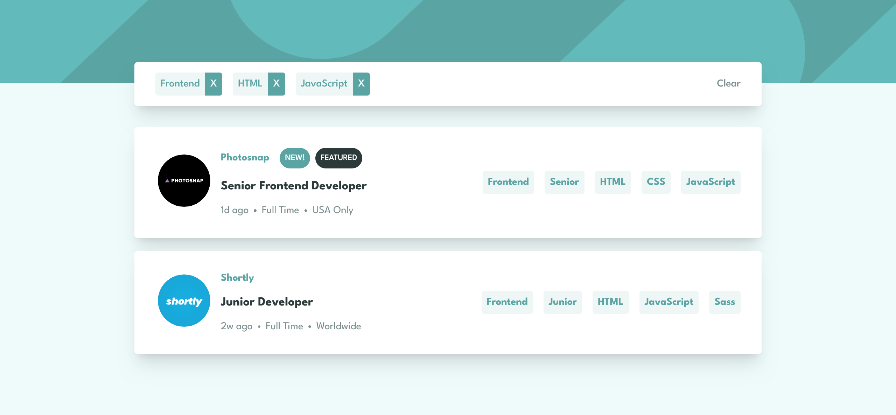

# Frontend Mentor - Job listings with filtering solution

This is a solution to the [Job listings with filtering challenge on Frontend Mentor](https://www.frontendmentor.io/challenges/job-listings-with-filtering-ivstIPCt). Frontend Mentor challenges help you improve your coding skills by building realistic projects. 

## Table of contents

- [Overview](#overview)
  - [The challenge](#the-challenge)
  - [Screenshot](#screenshot)
  - [Links](#links)
- [My process](#my-process)
  - [Built with](#built-with)
  - [What I learned](#what-i-learned)
  - [Continued development](#continued-development)
  - [Useful resources](#useful-resources)
- [Author](#author)

**Note: Delete this note and update the table of contents based on what sections you keep.**

## Overview

### The challenge

Users should be able to:

- View the optimal layout for the site depending on their device's screen size
- See hover states for all interactive elements on the page
- Filter job listings based on the categories

### Screenshot

### Links

- Solution URL: [https://github.com/warnerb47/job-listings](https://github.com/warnerb47/job-listings)
- Live Site URL: [https://warnerb47.github.io/job-listings/](https://warnerb47.github.io/job-listings/)

## My process

### Built with

- [Angular](https://angular.io/) - JS framework
- [NGXS](https://www.ngxs.io/) - a state management pattern + library for Angular
- [Nx](https://nx.dev/) - build system + fast CI
- [release-please](https://github.com/googleapis/release-please) - automates CHANGELOG generation, the creation of GitHub releases, and version bumps
- [Sass](https://sass-lang.com/) - Css pre-processor

### What I learned

Handle stage management with NGXS.

### Continued development

Next step:
- Deep dive on state management with NGXS
- integrate TDD with jest for unit test and cypress for component testing
- use Mobile-first workflow

### Useful resources

- [setup angular store with ngxs](https://www.youtube.com/watch?v=0D6UJE_FuZ4) - This helped me to setup project structure with Nx and manage state with NGXS.

## Author

- Frontend Mentor - [@warnerb47](https://www.frontendmentor.io/profile/warnerb47)
- Twitter - [@warnerb47](https://www.twitter.com/warnerb47)

